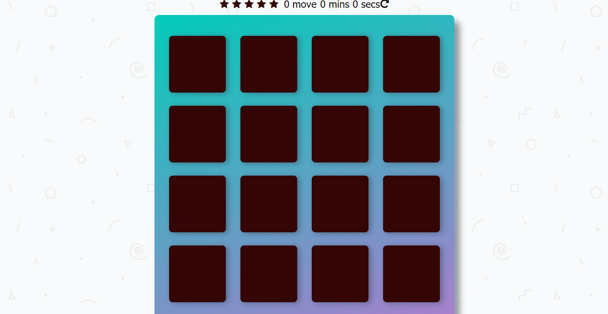

# Memory Game Project

## Instructions

The starter project has some HTML and CSS styling to display a static version of the Memory Game project. You'll need to convert this project from a static project to an interactive one. This will require modifying the HTML and CSS files, but primarily the JavaScript file.

To get started, open `js/app.js` and start building out the app's functionality

For specific, detailed instructions, look at the project instructions in the [Udacity Classroom](https://classroom.udacity.com/me).

## Contributing

This repository is the starter code for _all_ Udacity students. Therefore, we most likely will not accept pull requests.

For details, check out [CONTRIBUTING.md](CONTRIBUTING.md).

## What is the Memory Game
This is a simple game built to test a users memory. There's a deck of cards with different icons. 

## Challenge
Match cards in less time with less moves.

## How to Play
* Click on a card
* Keep revealing cards and working your memory to remember each unveiled card.
* Match cards properly with less moves and in faster time

## How I built the Memory Game
* I manipulated the DOM with JS, altered part of the HTML and also styled the game
* Created a deck of cards that shuffles when game is refreshed
* Created a counter to count the number of moves made by player and timer to know the duration of a play
* Addeded effects to cards when they match and are unmatched
* Created a pop-up modal when player wins game
